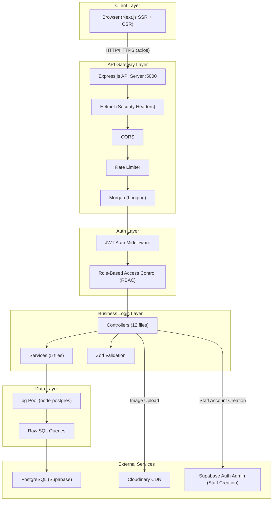
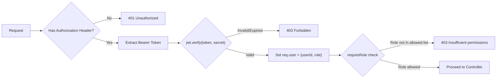

# SJS School ERP — System Architecture

## High-Level Architecture Diagram



---

## Request Lifecycle

```
1. Client Browser
   │
   ├── Next.js renders page (SSR or CSR)
   ├── Component mounts → useQuery/useMutation fires
   ├── axios interceptor attaches Bearer JWT token
   │
   ▼
2. Express Server (:5000)
   │
   ├── helmet()             → Sets security headers (X-Content-Type, CSP, etc.)
   ├── cors()               → Allows cross-origin requests (currently open)
   ├── express.json()       → Parses JSON body (2MB limit)
   ├── morgan('dev')        → Logs request method, URL, status, time
   ├── rateLimit            → Global: 300 req/15min, Auth: 30 req/15min
   │
   ▼
3. Route Matching
   │
   ├── Public routes (no auth): /api/students/apply, /api/teachers/apply, /api/students/check-scholar-number
   ├── Protected routes: authMiddleware → extracts JWT → sets req.user
   ├── Role-gated routes: requireRole(['PRINCIPAL', ...]) → checks req.user.role
   │
   ▼
4. Controller
   │
   ├── Validates request body (Zod schemas where applicable)
   ├── Calls service layer or executes direct SQL
   ├── Handles errors via handleError() utility
   │
   ▼
5. Service Layer
   │
   ├── Contains business logic (student approval, teacher creation, attendance marking)
   ├── Executes parameterized SQL queries via pg Pool
   ├── Uses transactions where needed (marks upsert)
   │
   ▼
6. PostgreSQL (Supabase)
   │
   ├── Connection pool: max 30, idle timeout 30s, connect timeout 5s
   ├── SSL enabled
   ├── Uses UPSERT (ON CONFLICT) for idempotent operations
   ├── Uses UNNEST for batch inserts (attendance)
   │
   ▼
7. Response
   │
   ├── JSON response with appropriate HTTP status
   ├── Error responses standardized via errorHandler.ts
   └── Client processes response, updates React Query cache
```

---

## Architecture Layers (Detailed)

### Layer 1: Client (Frontend)

| Aspect | Detail |
|--------|--------|
| Framework | Next.js 16.2.9 with Turbopack |
| Rendering | SSR for initial page load, CSR for dashboard interactions |
| State Management | React Query for server state, `useState`/`useEffect` for local state |
| HTTP Client | Axios with auto-injected Bearer token from `localStorage` |
| Auth Storage | `sjs_token` (JWT) and `sjs_user` (user JSON) in `localStorage` |
| Routing | File-based routing + `?tab=` query params for SPA-like tab navigation within dashboards |
| Auto-logout | 401 response interceptor clears storage and redirects to `/` |

### Layer 2: API Server (Backend)

| Aspect | Detail |
|--------|--------|
| Framework | Express.js 5.2.1 |
| Entry Point | `src/server.ts` → imports `app.ts` → listens on PORT 5000 |
| Middleware Stack | helmet → cors → json parser → morgan → rate limiters |
| Route Registration | 14 route files mounted under `/api/*` |
| Error Handling | Global error middleware + `handleError()` utility for PostgreSQL error codes |

### Layer 3: Authentication & Authorization



| Aspect | Detail |
|--------|--------|
| Token Type | JWT (HS256) |
| Token Lifetime | 24 hours (`expiresIn: '1d'`) |
| Token Payload | `{ userId: string, role: Role }` |
| Password Hashing | bcrypt (default 10 salt rounds) |
| Fallback Secret | `'supersecretkey'` (⚠️ INSECURE if env var is missing) |

### Layer 4: Controllers

12 controllers handle request/response for their respective domains:

| Controller | Responsibility | Direct SQL? | Uses Service? |
|-----------|---------------|-------------|---------------|
| `auth.controller.ts` | Login, refresh, logout | No | Yes (AuthService) |
| `attendance.controller.ts` | Today's attendance, mark, register | No | Yes (AttendanceService) |
| `student.controller.ts` | CRUD, apply, approve/reject | No | Yes (StudentService) |
| `teacher.controller.ts` | CRUD, apply, approve/reject, profile | No | Yes (TeacherService) |
| `parent.controller.ts` | CRUD for parent accounts | No | Yes (ParentService) |
| `class.controller.ts` | Hierarchy, assign teachers | Yes | No |
| `complaint.controller.ts` | CRUD, status updates | Yes | No |
| `leave.controller.ts` | Apply, list, approve/reject | Yes | No |
| `marks.controller.ts` | Get, upsert marks | Yes | No |
| `notifications.controller.ts` | CRUD notifications | Yes | No |
| `subject.controller.ts` | CRUD subjects | Yes | No |
| `upload.controller.ts` | Image upload to Cloudinary | Yes | No |

### Layer 5: Services

5 service files contain complex business logic:

| Service | Key Operations |
|---------|---------------|
| `auth.service.ts` | Login validation, bcrypt compare, JWT signing |
| `attendance.service.ts` | Today lookup, batch UPSERT via UNNEST, register queries |
| `student.service.ts` | Application workflow, approval (creates User + Student + Parent), CRUD |
| `teacher.service.ts` | Application workflow, approval (creates User + Teacher), profile management |
| `parent.service.ts` | Parent CRUD (creates User + Parent with linked children) |

### Layer 6: Database

| Aspect | Detail |
|--------|--------|
| Database | PostgreSQL (hosted on Supabase) |
| ORM | Prisma (schema-only, NOT used for runtime queries) |
| Query Method | Raw SQL via `pg` Pool |
| Connection Pool | Max 30 connections, 30s idle timeout, 5s connect timeout |
| SSL | Enabled |

### Layer 7: External Services

| Service | Usage |
|---------|-------|
| **Cloudinary** | Image storage for profile pictures. Uploads via memory buffer stream. Auto-converts to WebP. Folder: `erp_profiles` |
| **Supabase Auth Admin** | Staff account creation via `supabaseAdmin.auth.admin.createUser()` in `staff.routes.ts` |

---

## Architecture Decisions & Rationale

### 1. Raw SQL over Prisma ORM
**Decision**: Prisma is used only for schema definition and migrations. All runtime queries use raw SQL via `pg` Pool.
**Rationale**: Better control over complex queries (JOINs, UNNEST, window functions), avoid Prisma's query overhead, direct connection pool management.

### 2. Monolithic Architecture
**Decision**: Single Express server handles all API endpoints.
**Rationale**: Appropriate for current scale (single school, <500 users). Simpler deployment and debugging.

### 3. JWT without Refresh Token Rotation
**Decision**: Simple JWT with 24-hour expiry, no refresh token rotation.
**Rationale**: Simplified auth flow for school use case. The `refresh` endpoint exists but returns a stub response.

### 4. localStorage for Token Storage
**Decision**: JWT stored in `localStorage` rather than httpOnly cookies.
**Rationale**: Simpler cross-origin handling with separate frontend/backend servers. Known XSS risk—acceptable for internal school use.

---

## Future Architecture Considerations

| Enhancement | Benefit |
|------------|---------|
| Redis caching layer | Cache frequently accessed data (class hierarchy, teacher profiles) |
| Message queue (Bull/BullMQ) | Async processing for notifications, report generation |
| Microservices split | Separate auth, notifications, analytics into independent services |
| API Gateway (e.g., Kong) | Centralized rate limiting, logging, API versioning |
| WebSocket (Socket.io) | Real-time attendance updates, live notifications |
| CDN for frontend | Deploy Next.js to Vercel for global edge delivery |
